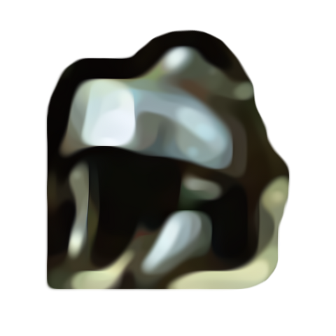
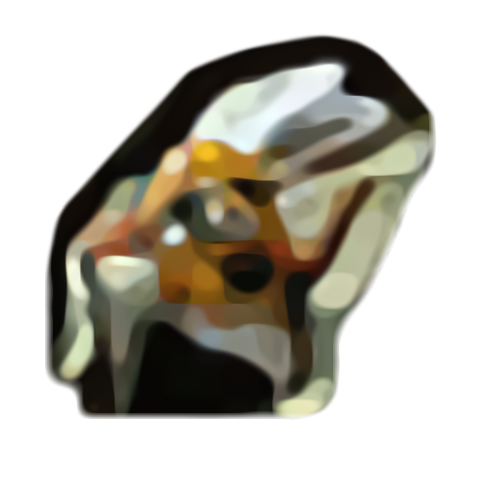
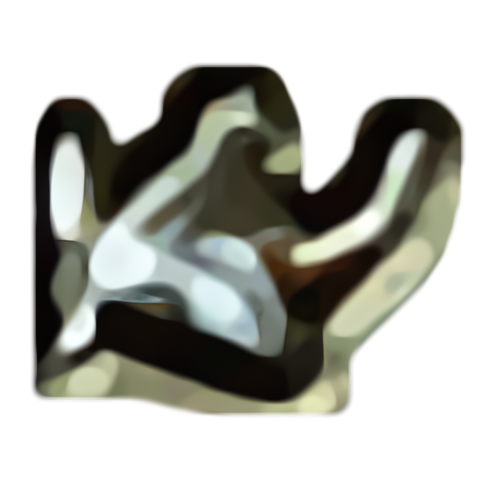
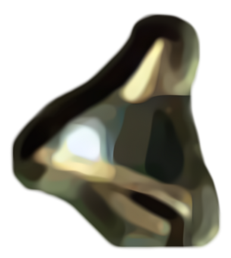
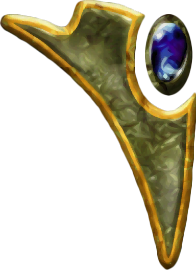
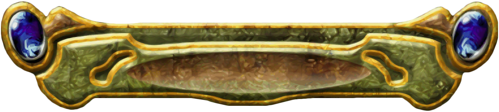
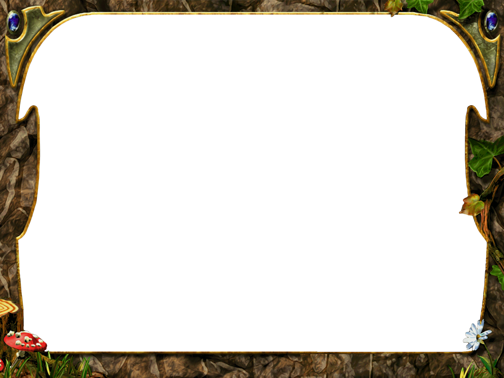
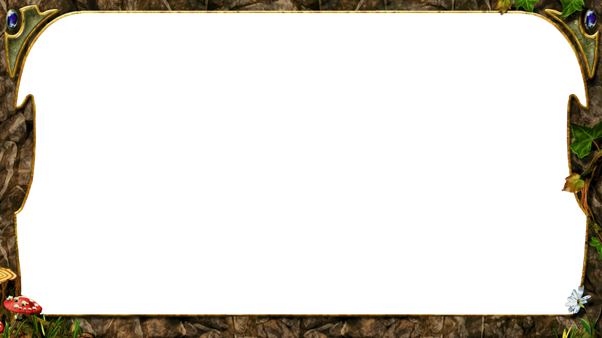

# GUI-Materialien

### Symbole

#### Völker

#### Haken

#### Kreuz

#### Arme der KI-Schwierigkeit

## Panels

### Panel-Ornamente links und rechts

### Kopfbanner

#### Ausgeschnittener Hauptmenürahmen 4:3

#### Ausgeschnittener Hauptmenürahmen 16:9

### Die verschiedenen Versionen der Hauptmenüpanels

#### Version 1 - Normal

#### Version 2 - Oben anders

#### Version 2.1 - ohne Ornamente

#### Version 2.2 - Gespiegelt, rund

#### Version 2.3 - Gespiegelt, rund, gespiegelt

#### Version 2.4 - Gespiegelt, rund, gespiegelt, Ornamente

#### Version 3.0 - Invertiert gespiegelt

#### Version 3.1 - Invertiert gespiegelt, gespiegelt

#### Version 3.2 - Invertiert gespiegelt, gespiegelt, ungedellt

#### Version 4 - Invertiert gespiegel, Quadratisch

### WM25-Logo

#### Original Logo

#### Logo mit verbesserter Lesbarkeit (z.B. für Thumbnails)

